# STO-CLARE — the manual

STO-CLARE reads the combat log Star Trek Online writes while you play and turns
it into tables and charts: how much damage you dealt, how much you took, what
each of your abilities contributed, who healed whom, and how one run compares to
another. This manual walks through every part of the program. If you have not
installed it yet, start with the [README](README.md).

The program never touches the game. It only reads a text file the game writes,
so nothing you do here can affect your account or your build.

---

## Before you start

Two things have to be true before any numbers appear:

1. Combat logging is switched on in the game. Type `/Combatlog 1` into the chat
   window and press Enter. **This has to be done again after every login.**
2. STO-CLARE knows where the log file is. That is the one setting you must fill
   in yourself — see [Settings → General](#general).

Then fight something, and press **Refresh Now**.

---

## The main window

Everything lives in one window. From top to bottom:

```
┌─ STO-CLARE ─────────────────────────────────────────────────────────┐
│ Settings  Ladder  Compare Combats                      ← top row    │
├─────────────────────────────────────────────────────────────────────┤
│ [combat you are reading ▼]  Combats  Refresh Now  Clear Log File    │
│ Auto Refresh  Save Combat  Upload  Copy Combat Summary  Overlay     │
│ Show only: [type ▼] [level ▼] [map ▼]                  ← filters    │
├─────────────────────────────────────────────────────────────────────┤
│ Summary │ Damage Dealt │ … │ Columns ▾ │      [Export XLSX] ← tabs   │
├─────────────────────────────────────────────────────────────────────┤
│                                                                     │
│   the table for the tab you picked                                  │
│                                                                     │
├─────────────────────────────────────────────────────────────────────┤
│   charts for the rows you selected                                  │
└─────────────────────────────────────────────────────────────────────┘
```

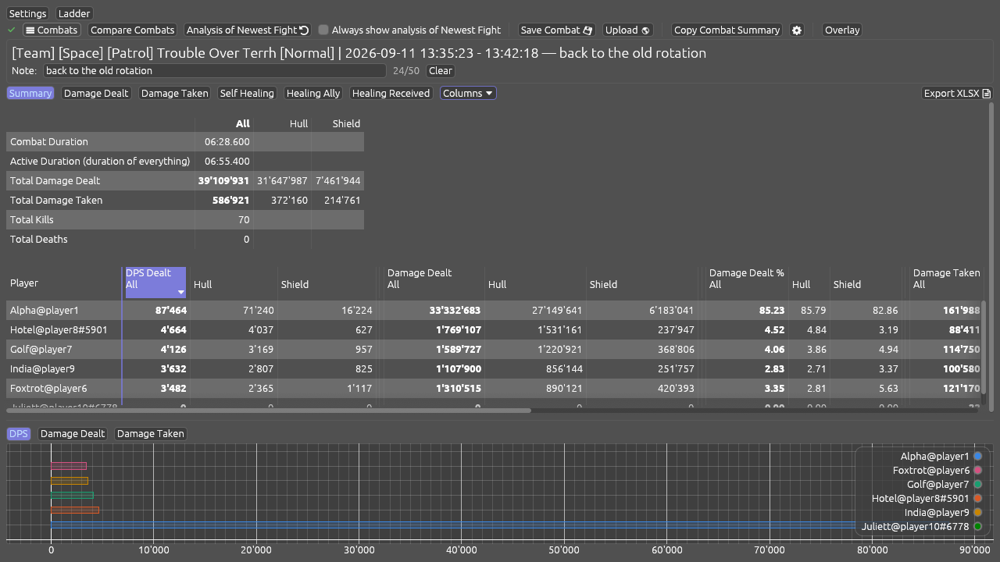

---

## Picking a combat

### The combats list

The wide drop-down at the top holds every combat found in your log, newest
first. Pick one and every tab below fills in with it.

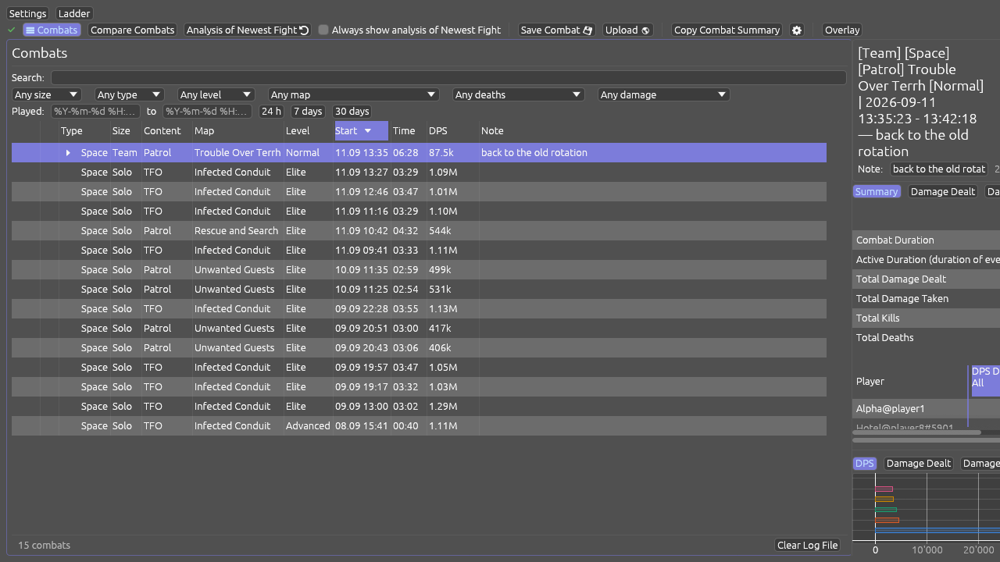

Each entry reads: whether you fought it alone or with others, the map name,
whether it was space or ground, the difficulty, and the time it started and
ended — for example
`[Solo] [TFO] Infected: The Conduit (Space) [Elite] | 11:56:10 - 12:02:27`.
**Solo** means one player in the log and **Team** more than one, which is the
same test the OSCR ladder uses, so a run of yours and one read from the ladder
say the same thing. The map and
difficulty are worked out from what happened in the fight, so you do not have to
name anything yourself.

Tip: a fight that ran long can end up split across two entries. If the numbers
look far too low, check the neighbouring entry.

### Narrowing the list

The menus under the toolbar — solo or team, type, level and map — cut the list
down. Each only offers what the others leave reachable, so you cannot pick a
combination that shows nothing. The solo/team menu appears only when your list
holds both kinds. A **Clear filter** button appears once any of
them is set.

### Describing a combat so you can find it again

A list of runs on the same map, all called the same thing and told apart only by
a timestamp, is hard to read a week later. So every combat can be given a short
description of your own.

1. Pick the combat in the list.
2. Click the **Note** field under the tabs — it sits right below the combat's
   title.
3. Type up to 50 characters: "new build", "no buffs", "rainbow boat", whatever
   tells you what that run was.

There is nothing to save. The description is kept with your settings and stays
with that combat, and it shows up **in the combats list itself**, after a dash:

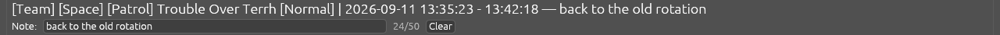

The counter next to the field (`0/50`) tells you how much room is left. Clearing
the text removes the description again.

Tip: this pairs with **Compare Combats** — label two runs before comparing them,
and you can tell at a glance which column is which build.

### The buttons around the list

| Button                        | What it does                                                                                                                   |
|-------------------------------|--------------------------------------------------------------------------------------------------------------------------------|
| Refresh Now                   | Re-reads the log and picks up combats fought since you last looked.                                                            |
| Auto Refresh when log changes | Keeps the list and the numbers current by itself while you play.                                                               |
| Save Combat                   | Writes the selected combat to a log file of its own, so you can keep or share it.                                              |
| Clear Log File                | Opens a list of every combat with tick boxes, and deletes only the ones you tick. Everything but the newest is ticked for you. |
| Copy Combat Summary           | Puts a short text summary on your clipboard, ready to paste into the game chat. It carries the note you wrote for the run.     |
| Upload                        | Sends the combat to the OSCR ladder — see [Uploading](#uploading-to-the-oscr-ladder).                                          |
| Overlay                       | Opens the small always-on-top window — see [The overlay](#the-overlay).                                                        |

### What lands on your clipboard

**Copy Combat Summary** builds a single line, ready to paste into the game chat:

```
CLA - [TFO] Infected: The Conduit (Space) [Elite] — Cheops build (12:32.200):
[PlayerName: DPS|Dmg] / @you: 225k|169M / @teammate: 174k|130M
```

(It is one line, wrapped here to fit the page.) The name of the run comes first,
then the note you wrote for it, then how long the fight lasted. The part in
square brackets is the key: it says which numbers follow each name, in that
order.

The ⛭ beside the button decides what goes in. Untick your note if you would
rather not share it, and untick metrics you do not need — the game cuts a long
chat line off, so the fewer you send, the more likely the whole thing arrives.
Players are listed in the order of the first metric you left ticked, best first.

---

## Reading one combat

### Choosing which columns you see

The tables carry more columns than most people want at once. **Columns** at the
end of the tab row hides the ones you do not use; the button says how many are
hidden, so a missing metric is never a mystery. **Show all** brings them back.

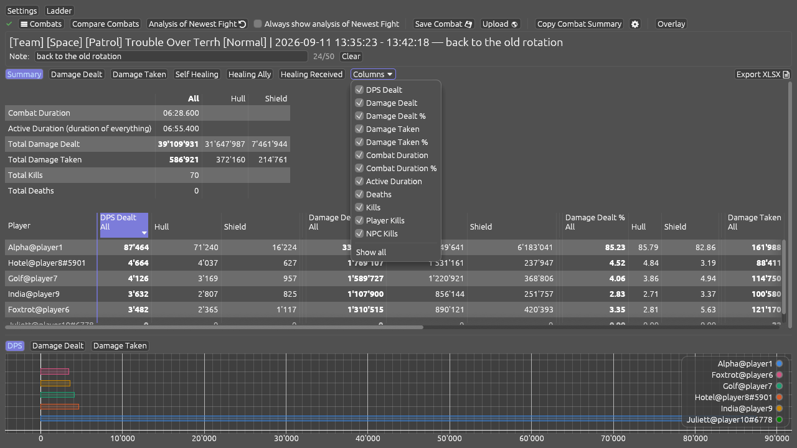

The two damage tabs share one choice and the three healing tabs share another —
they are the same table with the same metrics — and the choice is remembered
between runs.

### Saving a whole combat as a spreadsheet

**Export XLSX**, at the right-hand end of the tab row, writes the combat to a
spreadsheet you can open in Excel, LibreOffice or Google Sheets. The file holds
**one sheet per tab** — Summary, Damage Dealt, Damage Taken and the three
healing ones — each with every player, every row of the breakdown and every
metric that tab has, whether or not it is on screen. The numbers arrive as
numbers, so you can sort, total and chart them yourself.

### Summary

The Summary tab answers "how did this run go" in one screen: how long the fight
lasted, total damage dealt and taken, kills and deaths, and a row per player
with their DPS and totals.

Most numbers are split into **All**, **Hull** and **Shield** columns, so you can
see how much of a figure landed on hull and how much was eaten by shields. If
you prefer the compact table, turn the split off under
[Settings → General](#general).

Click any column heading to put the table in that order. The heading lights up
and carries an arrow for which way the order runs; click it again to turn it
round. That includes **Name** — click it and the rows are in alphabetical order,
which is how you find an ability whose name you know but whose size you do not. **All**, **Hull** and **Shield** are three headings, not one — click
Shield and the table is ordered by what landed on shields alone. This works the
same way on every tab, and the order you chose stays put when you open another
combat.

### Damage Dealt

One row per player, ordered by damage. This is where you find your DPS.

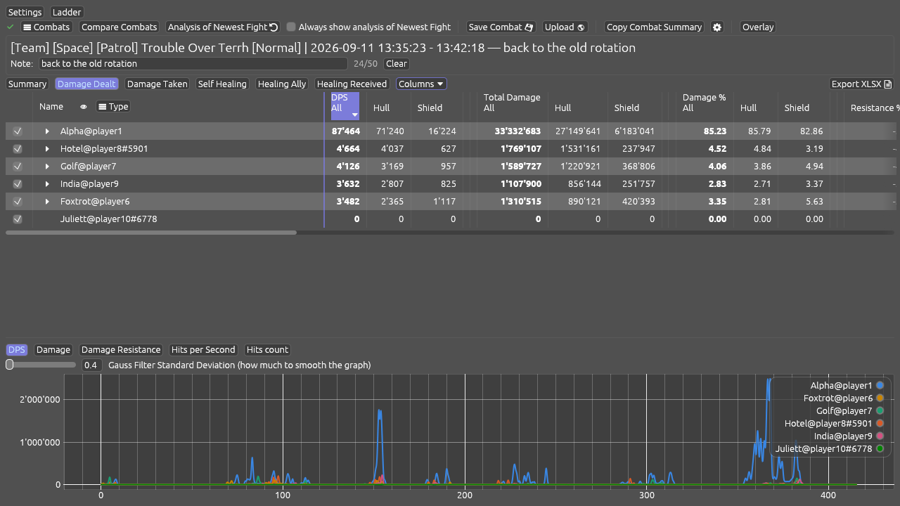

Click the little triangle at the start of a row and it opens up into everything
that player used, ordered by contribution:

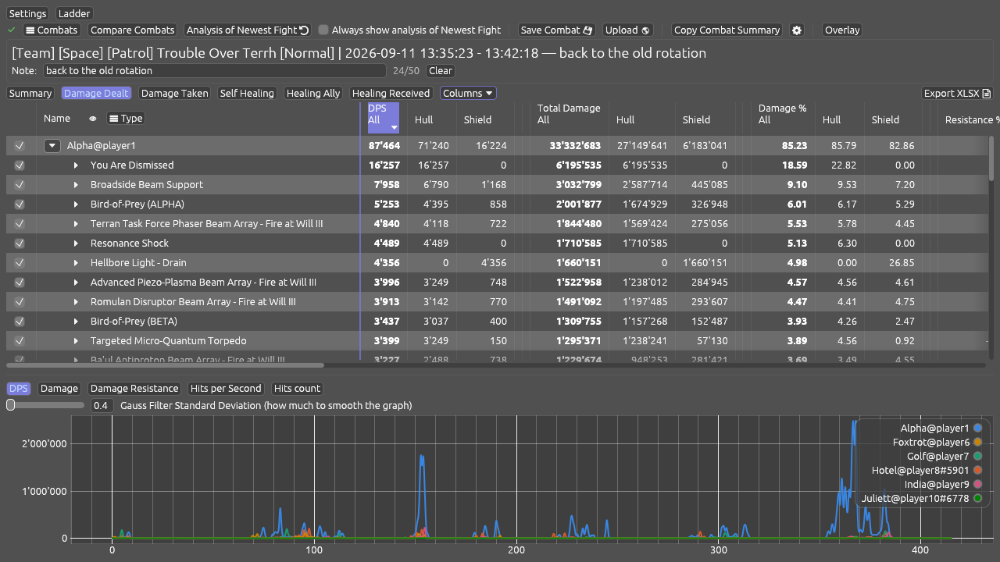

Read across the columns for one ability:

| Column       | What it tells you                                                                                             |
|--------------|---------------------------------------------------------------------------------------------------------------|
| DPS          | Damage per second that ability contributed over the whole fight.                                              |
| Total Damage | Everything it dealt, hull and shield.                                                                         |
| Damage %     | Its share of that player's damage. Useful for spotting what is actually carrying your build.                  |
| Resistance % | How much of the target's hull soaked the hit up. A negative number means you were cutting through resistance. |
| Max One-Hit  | The single biggest hit it landed.                                                                             |
| Average Hit  | What a typical hit did.                                                                                       |

Rows can be opened further where an ability has parts underneath it — a console
that spawns something, a pet, an anomaly.

### Damage Taken

The same table, for what was done to you: what hit you, how hard, and how much
your shields absorbed.

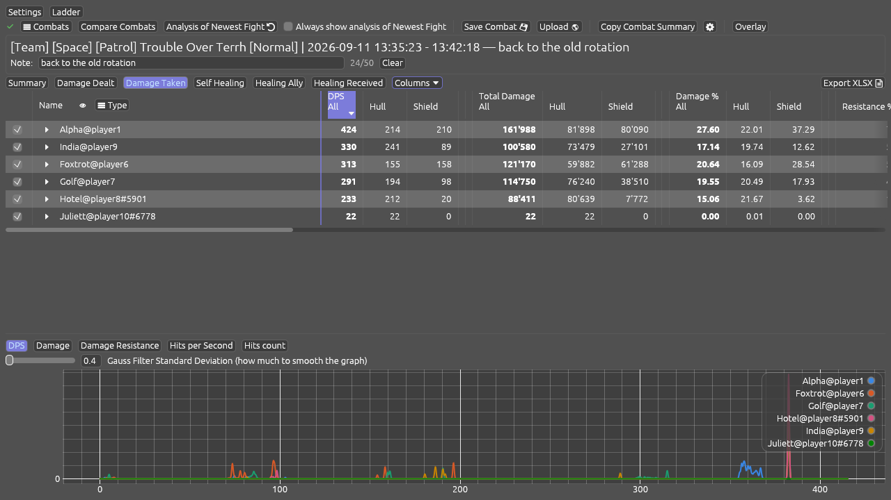

### The three healing tabs

Healing is split into three tabs that never count the same heal twice:

| Tab              | What it holds                    |
|------------------|----------------------------------|
| Self Healing     | What you healed on yourself.     |
| Healing Ally     | What you healed on other people. |
| Healing Received | What other people healed on you. |

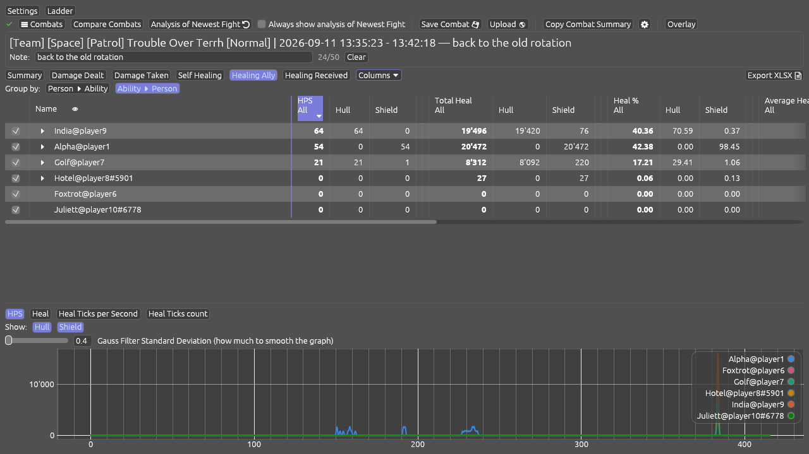

This split matters: on a normal run one gear proc healing you can be most of
your healing number, and if that is mixed in with what you did for the team, it
buries everything the team actually did.

### The charts

The strip along the bottom follows whatever rows you have selected in the table.
Its own tabs pick what is drawn — DPS, damage, damage resistance, hits per
second, hit counts — and the slider smooths the line so a spiky graph becomes
readable.

Select an ability in the table above and the chart follows it, so you can see
when in the fight it was actually doing something.

---

## Comparing combats

**Compare Combats** in the top row puts runs side by side. First tick the ones
you want:

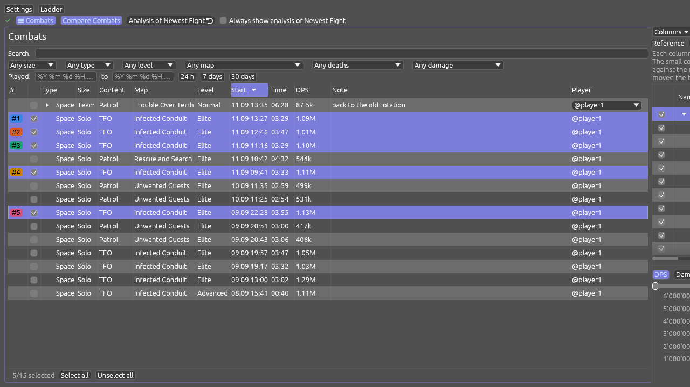

There is no limit on how many you tick. Two runs read most clearly side by side,
but a whole evening's worth is a fair thing to ask for — see
[Averages](#one-average-instead-of-many-columns) for reading a big pile of runs
at once.

Two things to know before you tick a dozen: past eight runs the chart's line
colours start over, so two lines can share a colour — the number in the column
heading is what tells them apart. And a very wide comparison takes a moment to
build; the picker says so before you press the button, rather than appearing to
hang.

### Narrowing the list

Above the list are the same **Show only** menus as in the main window — the kind
of map, the difficulty, and which map — plus a **Played** window for when the
runs were fought:

| Field or button       | What it does                                                   |
|-----------------------|----------------------------------------------------------------|
| Search                | Matches the name of the run and the note you wrote for it.     |
| Show only             | The kind of map, the difficulty, and which map.                |
| Played                | The window the runs were fought in, as `2026-07-23 20:07`.     |
| 24 h, 7 days, 30 days | Fill the window in for you, counting back from the newest run. |
| Select all            | Ticks every run the filters have left on screen.               |
| Clear selection       | Unticks everything.                                            |

Click into an empty **Played** field and it fills in with the oldest — or, on the
right-hand side, the newest — run in the list, ready to edit. Leave one side
empty for "anything before that" or "anything after that".

A run you have ticked never disappears from the list, even when the filters no
longer match it — it is going into the comparison either way, so it stays on
screen with a warning mark beside it. Untick it, or widen the filters to see it
back in place.

**Select all** adds to what you have already ticked rather than replacing it, so
you can pick a few Infected runs, change the filters, and add a few Hive ones.

Tip: a date typed halfway does nothing until it is complete, so the list does not
empty out under your hands while you are still typing. While it is incomplete it
is shown in red.

Then press **Compare selected**:

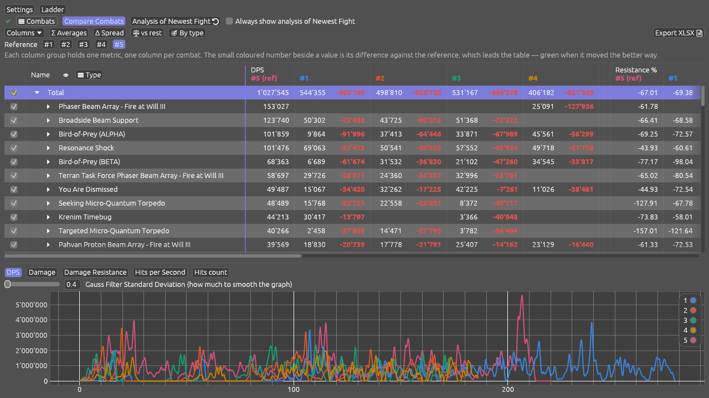

One run is the **reference**: it leads the table and every other run is read
against it. It starts as the run with the best DPS, and the
**Reference** line under the toolbar changes it — the picked run moves to the
first column, keeping its own number and colour, so a comparison can read as
"against my best run" or "against the one I flew the old build in".

Every other combat gets a small coloured number next to each value: green when
it moved the better way, red when it moved the worse way. The ability breakdown is lined up group by group, so you
are comparing the same ability across runs rather than reading two lists.

The **Columns** menu decides which metrics are shown. All of the compared
combats open on the same player, so you are looking at one player's runs rather
than several people's.

Your own notes come along for the ride. Where you have written one for a run, it
is repeated under that run's column heading and on the chart — in the picture
above the two runs read "warm-up run" and "Cheops build" rather than "#1" and
"#2".

The chart underneath draws one line per run for whichever ability row you have
selected, and each run's number and note are printed in the colour of its own
line — in the list at the top, and in every column heading. Pick a column, look
for the line in the same colour.

A run keeps its colour for as long as the comparison is open, whatever you
select or tick, so the colour is a reliable way to tell one run from another.
Where a run has nothing to draw for the row you selected — it never used that
ability — its number is left in the ordinary text colour instead.

Tip: a DPS difference on its own can hide what changed — firing more often while
each hit lands softer can come out looking like nothing happened. Switch the
breakdown on in the Columns menu and each difference is split into the part that
came from landing hits more often and the part that came from each hit landing
harder. The two always add up to the whole difference.

### Taking a run out of the comparison

Every run in the list at the top has a tick box. Untick one and it leaves the
table, the averages and the chart; tick it again and it comes back. Nothing goes
through the picker, so "what do the other four look like without this one?" is
one click and one more to undo.

The runs that stay keep the number and the colour they came in with, so #4 is
still #4 with #2 taken out. Only what is ticked is counted in the averages, the
spread and the Total.

### Comparing only part of a run

Down the left of the table there is a tick box on every ability row, and one on
the **Total** row that stands for all of them. Untick a row and it drops out of
the Total above, which is worked out again without it:

```
┌──────────────────────────────────────────────────────────────┐
│  [x] │ Name  👁            │   DPS #1   │   DPS #2           │
├──────────────────────────────────────────────────────────────┤
│  [–] │ Total (16 of 18 rows)│  334'696  │  314'242           │
│  [x] │  Phaser Beam Array   │  140'953  │  127'423           │
│  [ ] │  Broadside Beam Sup. │   87'580  │   91'975           │  ← out
│  [x] │  Pahvan Proton Beam  │   70'537  │   72'949           │
└──────────────────────────────────────────────────────────────┘
```

This answers questions a whole-run number cannot: how the two runs compare on
your beams alone, with the torpedo spread and the console procs set aside, or
what the run looks like without the one ability you swapped.

The rows you untick are only left out of the Total — their own numbers stay on
screen and keep their differences, so you can still see what you set aside. The
Total row says how much of the run went into it, so a part-run figure cannot be
mistaken for the whole one later, and it says the same in an exported file.

Everything is worked out again from scratch, not just the DPS: the resistance,
critical rate and accuracy shown on the Total are those of the abilities you
kept, exactly as if the rest had not been used. The chart follows too, as long
as the Total row is the one selected.

A run that used none of the abilities you ticked leaves its Total empty rather
than showing a zero, and is left off the chart — a zero would read as a run that
did nothing, when what happened is that it flew something else entirely.

The eye button next to **Name** takes the unticked rows off the screen
altogether, leaving only what the Total is made of. Press it again to bring them
back — it only hides them; ticking is what decides the Total.

Tip: the tick box on the Total row ticks everything at once, and clears
everything at once. Half-filled means some rows are out.

Your ticks last as long as the comparison. Going back to **Change selection**,
or starting a new comparison, starts again with every row counted.

### Finding what a run did differently

Two more things sit next to the tick boxes, for the question a wide comparison
is usually really about: not what these runs have in common, but what they do
not.

**Type** next to the `Name` heading lists the damage types the comparison
holds — Phaser, Antiproton, Plasma, Polaron, Disruptor, Kinetic and so on. Pick
one and the table shows **only that type's damage**: every figure in every row
is recalculated to it. A weapon group that also procs something else shows just
the proc when you pick the proc's type — "Polaron Beam Array" under `Cold` is
the few hundred DPS its Frostbite did, not the beams around it. Pick nothing and
you see everything, which is how it starts.

**Δ Differences** in the toolbar hides the rows the runs agree on, leaving what
they differ over. Two controls appear with it:

| control | what it does |
|---|---|
| Damage % / DPS | what the spread is measured in |
| − and + and the slider | how large a spread has to be for the row to stay |

A **Spread** column appears beside the name, holding the figure the slider is
compared against, so you can see why a row is on screen rather than only that it
is. `Mycelial Lightning` at `0, 0, 19480, 19535, 0` DPS has a spread of 19'535 —
its largest run less its smallest — and stays as long as the slider is under
that.

Measured in **Damage %** — the same figure as the column of that name — a row is
compared by how much of that run it was, so a shorter or weaker run does not
look like a different build in every row at once. Measured in **DPS**, it is
compared by what it was actually worth. The − and + buttons step by 0.1% and by
50 DPS, for when the slider is too coarse.
Neither is right for every question, so both are there, each with its own slider
setting.

A run that never used a row counts as zero, so "flew this at all" is the largest
difference there is. Rows missing from some runs say so beside the name — `(in 2
of 5)` — because "flown in two runs out of five" and "flown in all five, but
unevenly" are different findings.

The rows stay in their usual order, so a row you know from the full table is
where you left it; only the ones nobody differs over go.

Worked example, five runs of the same patrol: at a small setting the table drops
from 25 rows to 9. Turned up, two rows are left — the antiproton beams one build
flew and the phaser group the other leaned on. That is the difference between a
rainbow build and a single-flavour one, without reading a single number.

```
Δ Differences   [share of combat] [DPS]   ──○────  18.5   min difference (pp)

  Name  👁  ☰ Type                        #1      #2      #3      #4      #5
  Total                                317'792 424'411 392'343 441'869 406'217
  Ba'ul Antiproton Beam Array  (in 3 of 5)
  Omni-Directional&Standard Phaser Beam Array  (in 2 of 5)
```

The Total above follows both of them: it counts the rows that are ticked **and**
on screen. Narrow the table to one damage type and the Total is that type's;
raise the difference slider and it is the total of what is left. What you read
is what you see.

### What one run did differently from the rest

**⚖ vs rest** answers the question a pile of runs is usually about: why is *this*
one different? Press it and a **ΔDPS vs rest** column appears beside the name:
the reference run's DPS on the row, less what the other runs averaged on it. Pick
a different run on the **Reference** line to measure that one instead. The rows are put in the order of how much they weighed.

For `Mycelial Lightning` at `0, 0, 19480, 19535, 0`, run #3 reads **+14'596** —
it did 19'480 where the others averaged 4'884 — and run #1 reads **−9'754**,
because it never used the thing at all.

The rows open ordered by the largest gain, because what a comparison is usually
being asked is what a run did *better*. Click any column heading to order by
that column instead, and click it again to turn the order round.

It reads as an account, because the figures add up: the rows sum exactly to the
difference shown on the Total. So a run that came out 47k DPS ahead of the
others might read "Ba'ul beams +32k, Broadside +11k, Phaser overload −8k" — and
those are the reasons, not a ranking of what was biggest.

A run that never used a row counts as zero for it, so "flew this at all" shows
up as the whole of that row's weight.

Hover a figure and it spells out the arithmetic — what this run did, what the
others averaged — and adds one more thing: how far out of line the row is
compared with how much the other runs disagree among themselves. A row two or
three times further out than the others' own spread is a real oddity; one at
half of it is ordinary variation.

### The runs split by damage type

**🎯 By type** in the toolbar opens a small window: one line per damage type, one
column per run, saying what share of that run the type came to. Hover a figure
for the damage behind it.

```
┌─ Damage by type ─────────────────────────────────┐
│  Damage type      #1     #2     #3     #4     #5 │
│  Phaser         32.9%  14.9%  70.3%  72.0%  62.1%│
│  AntiProton     12.4%  51.6%   0.0%   1.2%   0.0%│
│  Proton         20.8%  15.8%  16.0%  18.0%   7.0%│
│  Disruptor       9.0%   0.0%   0.0%   0.0%   0.0%│
│  Polaron         8.9%   0.0%   0.0%   0.0%   0.0%│
└──────────────────────────────────────────────────┘
```

That is one rainbow run, one antiproton run and three phaser runs, in five
lines. The types the runs differ over most are at the top; the ones they all
lean on equally sit below.

Each type opens up: the arrow beside it lists the rows it is made of, largest
first, so "Phaser 70%" turns into which beams, turrets and procs that 70% was.
A row buried under a weapon group is named with the group it came out of.

Damage dealt to shields is counted here, even though the game does not record
what flavour of energy hit a shield — the figure follows the weapon the row
belongs to. Where a row deals two types at once and there is nothing under it to
tell them apart, it is counted as **mixed** rather than dropped, so the column
still adds up to the run.

### One average instead of many columns

With more than a handful of runs on screen there are more columns than anyone
can read across. The **Averages** button beside the Columns menu folds them
together: one column per metric, averaged over every run in the comparison.

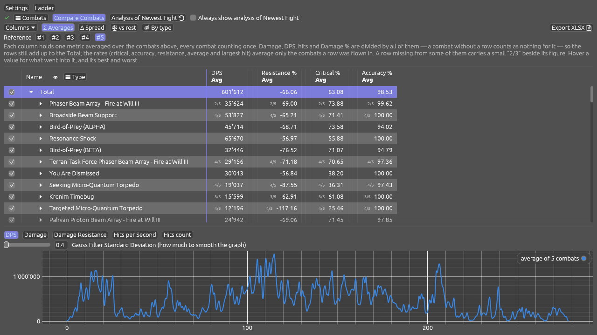

Every run counts once, and a run that never used an ability is left out of that
ability's average rather than counted as a zero — two runs with the Kemocite
proc average those two, not two out of twelve. Hover an averaged value and it
tells you how many runs went into it, and the best and worst of them.

The chart follows: instead of one line per run it draws the single line those
runs average out to, over the length of the longest of them. It is a true
average and not a total — two runs of 90k DPS average to 90k, not 180k — and the
same goes for the hits charts.

The differences disappear in this mode: an average has nothing to be measured
against. Press the button again to go back to the columns.

### Saving a comparison as a spreadsheet

**Export XLSX** on the right of the same row writes what you are looking at to a
spreadsheet file you can open in Excel, LibreOffice or Google Sheets.

What lands in the file:

| In the file                                           | Not in the file                                                       |
|-------------------------------------------------------|-----------------------------------------------------------------------|
| Which runs it is of, with your notes and the player   | The coloured differences — a spreadsheet subtracts two columns itself |
| One column per metric per run, or one averaged column | The chart                                                             |
| Every ability row, folded away on screen or not       |                                                                       |

The numbers arrive as numbers, so you can sort, total and chart them yourself.
Where a run has nothing for a row, that cell is left empty rather than filled
with a zero, so an average or a chart in the spreadsheet does not count it.

---

## The overlay

**Overlay** opens a small always-on-top window that shows the newest combat
while you play. It always follows the newest fight, whatever combat you have
open in the main window.


Two buttons sit on the overlay itself, along its bottom edge:

| Button | What it does                                                                                                                              |
|--------|-------------------------------------------------------------------------------------------------------------------------------------------|
| ⛭      | Picks which columns the overlay shows. DPS is on to begin with; tick as many more as you want to watch.                                   |
| ✋      | Lets you drag the overlay around. Switch it off again and the overlay stops taking mouse clicks, so it cannot get in the way of the game. |

Away from those two buttons the overlay ignores the mouse entirely, so you can
click straight through it at whatever is behind — the game included. Only when
you move the pointer onto the buttons does it start taking clicks again.

If the overlay opens with nothing but the word "Player" in it, it has not been
given a combat yet — press **Refresh Now** in the main window and it fills in.

### Seeing the game through it

The overlay can be made see-through, so it sits over the game without hiding a
chunk of it. Go to **Settings → Visuals** and drag **Overlay Opacity**: all the
way right is solid, all the way left is as faint as it goes. Only the overlay
changes; the main window stays as it is.

The figures themselves stay solid however faint you make the background, so you
can still read your DPS at a glance while the game shows through around it.

It never goes fully invisible, on purpose — you would have no way left to find
it and switch it off.

On Linux in a Wayland session this always works. Elsewhere it depends on your
desktop being able to draw see-through windows; if it cannot, the overlay simply
stays solid.

The overlay remembers where you put it and comes back there next time. It uses
the same colours as the main window.

On Linux in a Wayland session the overlay stays above the game even in full
screen. In an X11 session it opens as an ordinary always-on-top window, and
whether it stays above a full-screen game is up to your window manager — running
the game in windowed mode is the reliable answer there.

---

## Uploading to the OSCR ladder

**Upload** sends the selected combat to the OSCR ladder and shows you where the
run placed. When it works, the window says so in the ladder's own words and
offers a link straight to your run on the ladder site. When it does not, it now
tells you why — "Combat log is empty", or that the map and difficulty have no
ladder for that period — instead of a bare failure.

An upload can also succeed and produce no ladder entries at all. That usually
means the map and difficulty have no ladder for this period, or the ladder only
accepts solo runs.

---

## The Ladder

**Ladder** in the top row opens the standings in a window of its own, so you can
read a run in the main window while it is up. Pressing the button again puts it
away.

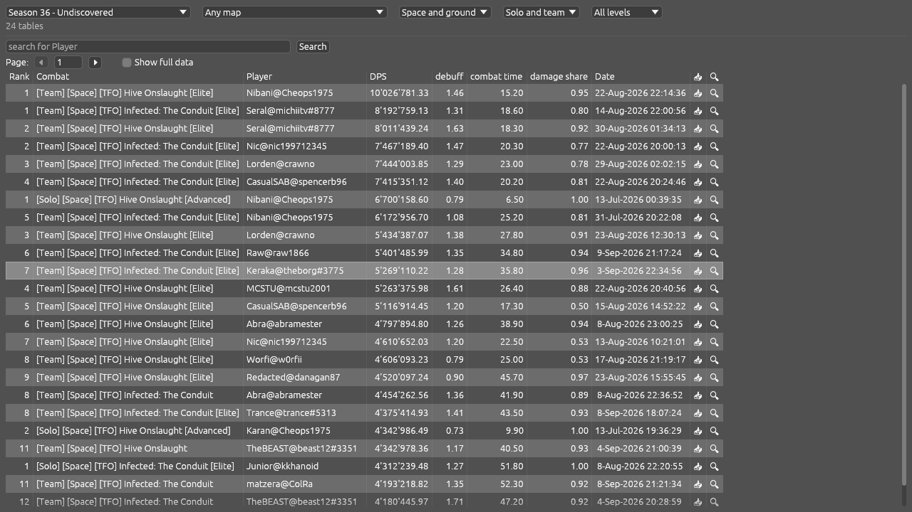

### Finding a table

Instead of one long list of tables, five menus narrow it down:

| Menu             | What it picks                                                     |
|------------------|-------------------------------------------------------------------|
| Season           | Newest first. **All seasons** searches the whole ladder at once.   |
| Map              | Choosing one also settles whether it was space or ground.          |
| Space and ground | Where the fight was.                                               |
| Solo and team    | The ladder keeps separate tables for solo runs.                    |
| All levels       | Normal, Advanced, Elite, or Any for tables that are not split.     |

Each menu only offers what the other four leave reachable, so no combination you
can pick empties the list. A choice that cannot survive your next one is let go —
pick a map with no Elite table and the level goes back to all levels rather than
showing you nothing.

Under the menus is what is left: the table's name when one table matches, or how
many when several do. Several is normal when you are looking for a player rather
than a table.

### One run, one row

The ladder keeps a map's runs in several tables at once — a catch-all for the
map, one for each level, and separate ones for solo runs — and a single fight is
entered into all of the ones it qualifies for. Ask across several tables and the
same run therefore comes back two to four times, with the same figures each
time. They are folded into one row.

That row can say more than any of the originals could. A ladder entry carries no
map and no level of its own; both live on the tables it is in. So the folded row
is named from the set of them, in the same shape the program names your own
fights: `[Solo] [TFO] Hive Onslaught (Space) [Elite]`.

**Rank** is then the run's placing **in its own table**, not its position in the
answer — which is why three rows in a row can all say 1. They are firsts in three
different tables, and the name beside each says which.

**Solo** and **Team** mean what they do everywhere else: one player in the log,
or more. Solo is exact, because the ladder only admits a one-player run to a
solo table. Team is worked out by a run *not* being in any solo table — which
leaves one gap: twenty of the ladder's map-and-level combinations have no solo
table at all, and a run fought alone on one of those reads as Team, because
nothing in the ladder's data says otherwise.

**Search** finds a player by any part of their handle, and it stays put while you
narrow everything else — so you can follow one person from season to season, or
across every map at once.

### Reading a run from the ladder

Two icons sit at the end of every row: 📥 saves that run as a log file, and 🔍
opens it in the main window with everything the program can show — all the tabs,
the charts, the ability breakdown.

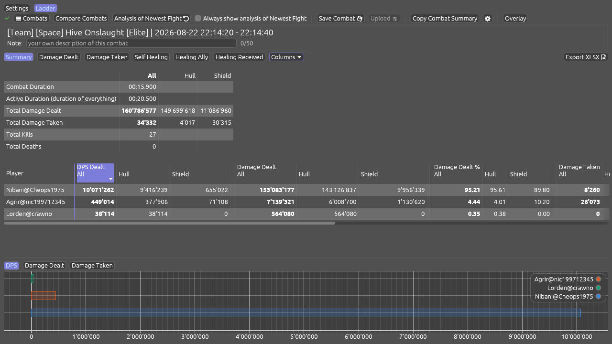

Your own log is not touched or changed. A mark at the top says whose fight you
are looking at, and **Back to my log** puts yours back.

### Comparing it with your own

With a run on screen, press **Compare Combats** as usual. The run is already in
the comparison — ticked, greyed out, and not for unticking, because it is what
you opened. Beside it is your own list, narrowed to the same map and level as the
run, since that is nearly always what you want to compare against. Where you have
never played that map, it falls back to the same level.

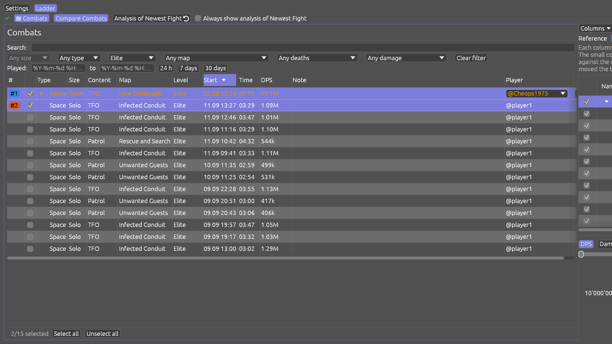

Tick one of your own fights — one is enough — and press **Compare selected**.

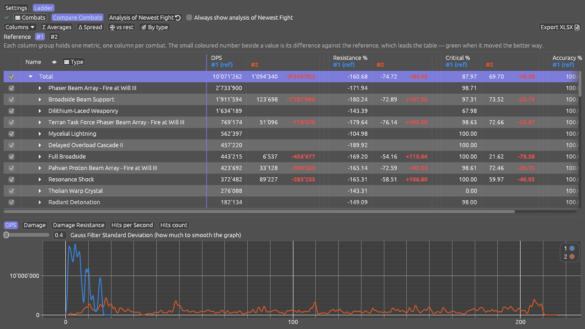

One thing to expect: the two runs are by different people, so each column has its
own player picker in the heading. Your column opens on you, theirs on them.

---

## Settings

**Settings** is in the top row. Nothing is applied until you press **Ok** at the
bottom.

### General

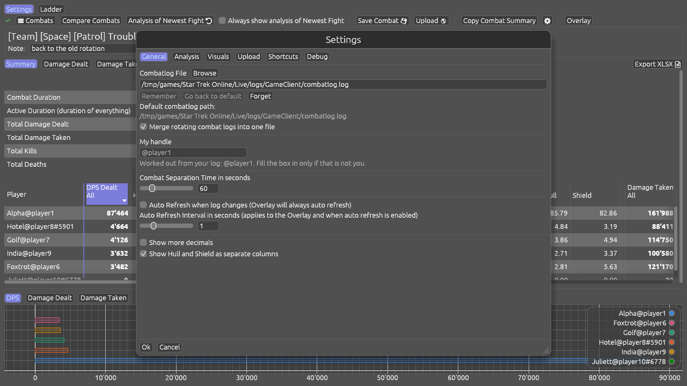

| Setting                                  | What it does                                                                                                                                                                                        |
|------------------------------------------|-----------------------------------------------------------------------------------------------------------------------------------------------------------------------------------------------------|
| Combatlog File                           | The path to the game's `combatlog.log`. Use **Browse** to find it; it sits in `<your STO installation>\Star Trek Online\Live\logs\GameClient\`.                                                     |
| Remember / Go back to default / Forget   | Keeps one log as the one to come back to — see below.                                                                                                                                               |
| Merge rotating combat logs into one file | The game starts a new log every hour, so your fights end up spread over many files. With this on, they are merged back into one so everything shows up together. The originals are only removed once the merged file has been checked byte for byte. |
| Combat Separation Time                   | How long a lull has to last before the next fighting counts as a new combat.                                                                                                                        |
| Auto Refresh / interval                  | Whether the numbers keep themselves current, and how often.                                                                                                                                         |
| Show more decimals                       | More precision in the tables.                                                                                                                                                                       |
| Show Hull and Shield as separate columns | Off gives you the compact table, with hull and shield only in the hover box.                                                                                                                        |

#### A log to come back to

Reading a run from the ladder, or a single fight you saved out of the way, points
the program at another file. Finding your own again used to mean walking the file
dialog back to it every time.

**Remember** stores the file above as the one you come back to. **Go back to
default** puts it back whenever you have wandered off, and **Forget** drops it.
The remembered path is printed underneath in full, so it is never a guess which
file that button leads to.

Tip: the game's own hourly log rotation means the file you want is usually
`combatlog.log` with the merging option on. Remember that one, and any excursion
is one click from home.

### Analysis

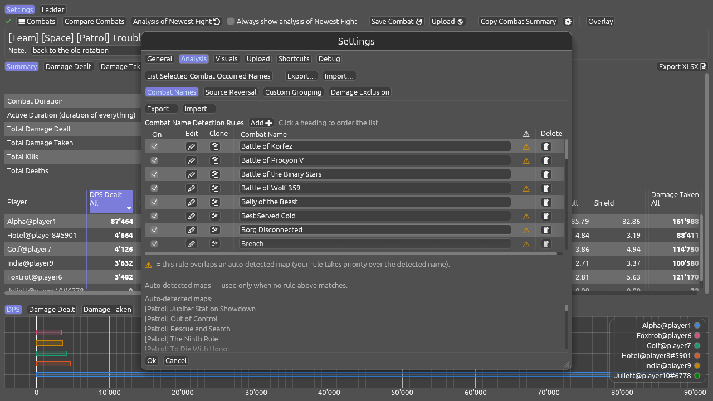

You do not need this section to read your damage. It changes how rows are named
and grouped.

| Tab              | What it is for                                                                                                                                                         |
|------------------|------------------------------------------------------------------------------------------------------------------------------------------------------------------------|
| Combat Names     | Your own rules for naming a combat. The list below the rules shows the maps recognised automatically, which is what is used when no rule of yours matches.             |
| Source Reversal  | Turns a group inside out: the effect on top and the pets or anomalies underneath, rather than the other way round. The Tachyon Net Drones console is the classic case. |
| Custom Grouping  | Folds several effects into one row — useful for a weapon with an extra proc, like the Advanced Piezo Beam Array and its Technical Overload.                            |
| Damage Exclusion | Leaves chosen damage out of the tables entirely.                                                                                                                       |

**Source reversal** in more detail: some damage and healing does not come
straight from you — pets, anomalies, consoles that spawn something. Those show
up as a row you can open, with the individual effects underneath. Sometimes you
want it the other way round: the effect on top, the pets underneath. That is
what a reversal rule does. The Tachyon Net Drones console is the classic case —
by default its effect is scattered over many rows, and one rule folds it into a
single row you can open. The settings ship with a ready-made example for the
starship trait Spore-Infused Anomalies; tick its "on" box to use it.

**Custom grouping** in more detail: a grouping rule folds several effects into
one row, which helps with a weapon that has an extra proc — the Advanced Piezo
Beam Array, whose Technical Overload fires alongside the beam itself. There is a
ready-made example for the Dark Matter Quantum Torpedo, again switched on with
its "on" box.

A warning mark next to one of your rules means it overlaps a map that would be
recognised automatically. Your rule still wins; the mark is only there so you
know why the name is not what you expected.

**List Selected Combat Occurred Names** shows every name that appeared in the
combat you are reading, which is the easy way to find the exact wording a rule
needs.

### Visuals

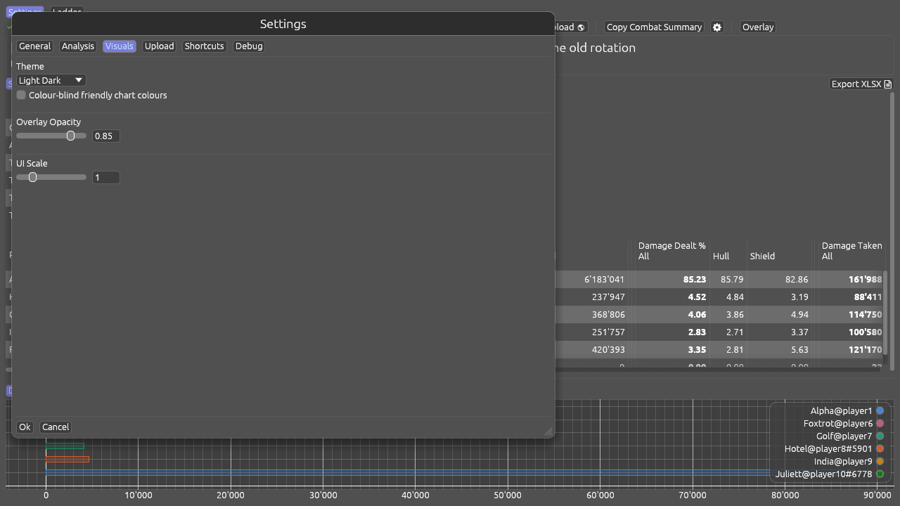

Pick a theme and set the interface scale. The scale is a multiplier — raise it
if the text is too small on a large screen. The themes are shown side by side in
the [README](README.md#themes).

**Colour-blind friendly chart colours** redraws the lines and bars of every
chart in a set of colours chosen to stay apart for red-green colour blindness,
which affects about one man in twelve. The ordinary set keeps neighbouring
series apart, but a chart with six or eight things on it can put two of them
side by side that look the same; this set is spaced out across the whole eight,
mostly by using light and dark rather than hue. Each theme has its own version,
so the colours still suit a dark or a light background.

Nothing else changes colour. The green and red differences in Compare and the
little status marks stay as they are — they already tell you which is which
without the colour, by the `+` or `-` in front of the number and by what the
mark says.

### Upload

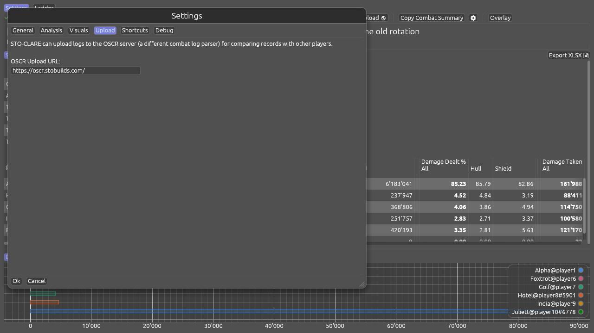

The address of the ladder server. Leave it alone unless you have been told to
change it.

### Debug

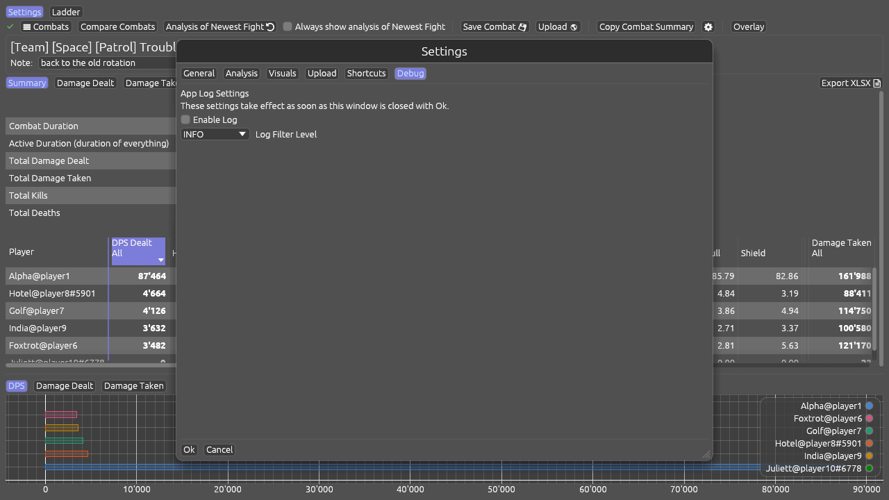

Writes a diagnostic log next to your settings. Leave it off unless you are
chasing a problem or someone has asked you for the file.

**Enable Log** starts writing the moment you press OK, and the level you pick
applies just as immediately — you do not have to start the program again, which
matters when the thing you want a log of is happening right now. Turning it off
closes the file straight away.

---

## Coming from the original STO_CombatLogAnalyzer

Your naming rules, grouping rules and every other setting can be carried over,
and the original program is left working. Which route you need depends on where
your old settings live.

**If you used an older version of this program** (anything before the rename),
there is nothing to do — your settings are picked up automatically the first
time STO-CLARE starts.

**If you used the original STO_CombatLogAnalyzer**, it keeps its settings in a
file named `STO_CombatLogAnalyzer_Settings.json`, sitting in the same folder as
the program itself. Copy it across by hand:

1. Find `STO_CombatLogAnalyzer_Settings.json` in the folder you run the original
   program from.
2. Copy it — do not move it — into the STO-CLARE settings folder:
   - Linux: `~/.config/STO-CLARE/`
   - Windows: `%APPDATA%\STO-CLARE\`
3. Rename the copy to exactly `STO-CLARE_Settings.json`.
4. Start STO-CLARE.

Everything arrives: the path to your combat log, the combat separation time,
your combat naming rules, your custom grouping and source reversal rules, the
theme and interface scale, and the ladder address. Sections that did not exist
in the original simply start at their defaults.

Because you copied rather than moved the file, your original installation is
untouched and keeps working if you want to go back to it.

Tip: if you happen to keep STO-CLARE in the same folder as the original program,
you can skip the renaming — the old file is found there and read once, then
written into the settings folder under the new name.

---

## Common situations

| If you want to…                      | Do this                                                     |
|--------------------------------------|-------------------------------------------------------------|
| See only Elite runs of one map       | Use the type, level and map menus under the toolbar.        |
| Find out what is carrying your build | Damage Dealt, open your row, read the Damage % column.      |
| Compare two runs of the same map     | Compare Combats, tick both, read the green and red numbers. |
| Watch your DPS while playing         | Open the Overlay; add more columns with ⛭.                  |
| Label a run so you find it later     | Type into the Note field under the tabs.                    |
| Share your numbers in chat           | Copy Combat Summary, then paste in the game.                |
| Keep one fight and clear the rest    | Clear Log File, untick the one you are keeping.             |
| See one ability over time            | Select its row; the charts at the bottom follow it.         |

## What can go wrong

| Symptom                                  | Likely cause                                                              | What to do                                                                                                 |
|------------------------------------------|---------------------------------------------------------------------------|------------------------------------------------------------------------------------------------------------|
| The combats list is empty                | Combat logging is off in the game                                         | Type `/Combatlog 1` in the game chat, fight something, press Refresh Now.                                  |
| Still empty after that                   | The path to the log is wrong                                              | Settings → General: the path must end in `combatlog.log`.                                                  |
| Only your newest fights show up          | The game split the log into several files                                 | On Linux, leave log merging switched on. On Windows, add `-NoAutoRotateLogs` to the game's launch options. |
| The overlay shows only the word "Player" | It has not been handed a combat yet                                       | Press Refresh Now in the main window.                                                                      |
| The overlay sits behind the game         | X11 session, or your window manager decided otherwise                     | Use a Wayland session, or run the game in windowed mode.                                                   |
| Numbers look far too low                 | The fight is split across two entries in the list                         | Check the neighbouring entry.                                                                              |
| A combat is named wrongly                | One of your own naming rules is matching first                            | Settings → Analysis → Combat Names; a warning mark shows which rule overlaps.                              |
| The upload produced no ladder entries    | That map and difficulty have no ladder for the period, or it is solo-only | Nothing to fix; the run is still uploaded.                                                                 |

## FAQ

**Q: Does this change anything in the game?**
A: No. It only reads a file the game writes.

**Q: Do I have to keep the program open while I play?**
A: No. The game writes the log whether or not STO-CLARE is running. Open it
afterwards and press Refresh Now. Keep it open only if you want the overlay or
live numbers.

**Q: Where are my settings kept?**
A: `~/.config/STO-CLARE` on Linux, `%APPDATA%\STO-CLARE` on Windows.

**Q: Why does one ability show as several rows?**
A: Some abilities write more than one kind of record — a beam and its proc, or a
console and the thing it spawns. A custom grouping rule folds them into one row;
see [Settings → Analysis](#analysis).

**Q: Can I start over?**
A: Delete the settings file from the folder above. The program writes a fresh
one with its defaults on the next start.

## Where to get more help

- Report a problem or ask a question in the
  [issue tracker](https://github.com/raman78/STO-CLARE/issues).
- Every release and what changed in it is listed in
  [CHANGELOG.md](CHANGELOG.md).
</content>
