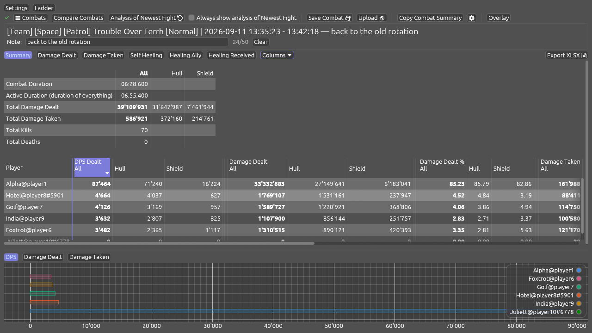
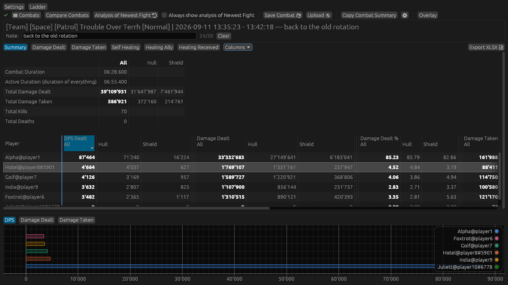
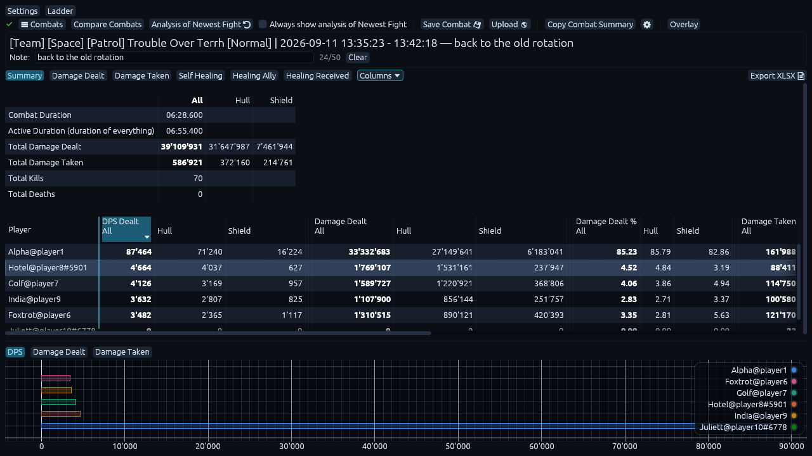
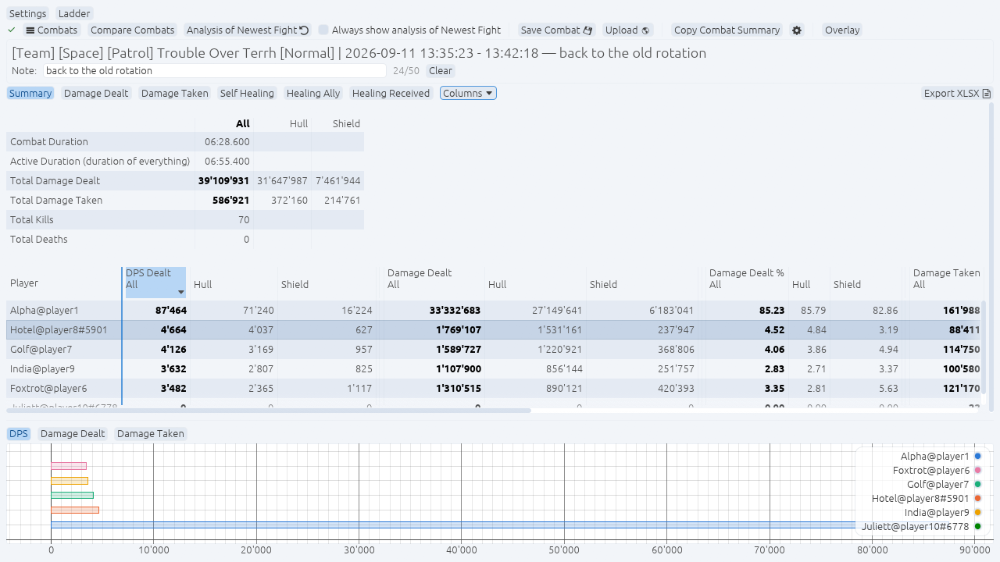
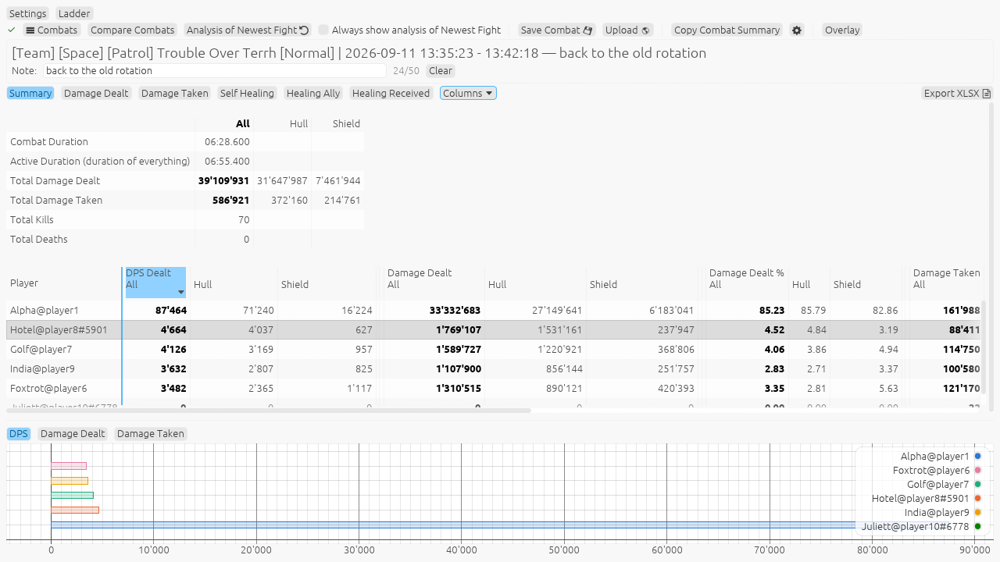

# STO-CLARE

**C**ombat **L**og **A**nalyzer **Re**Mastered — a desktop tool that reads the
combat log Star Trek Online writes and turns it into tables and charts: damage,
healing, hits, kills, per-ability breakdowns, a live overlay, and uploads to the
OSCR ladder. It runs on Linux and Windows.

STO-CLARE grew out of
[AnotherNathan/STO_CombatLogAnalyzer](https://github.com/AnotherNathan/STO_CombatLogAnalyzer)
and everything that tool does is still here. It was renamed in version 2.0
because it has gone its own way — the original author is not involved in it and
is not the person to ask about it. The original copyright notice stays in the
licence files, where it belongs.

**[Read the manual](MANUAL.md)** for a walk through every part of the program,
with pictures.

Coming from the original STO_CombatLogAnalyzer? Your naming rules, grouping
rules and every other setting can be carried over, and your old installation
keeps working — see [Bringing your old settings
across](#bringing-your-old-settings-across).

## What you need before you start

- Star Trek Online, and a character you have fought something with.
- Combat logging switched on in the game (step 2 below).
- Nothing else — STO-CLARE is a single program with no separate runtime.

## Quick start

1. Install it (see [Install](#install)).
2. In the game's chat window, type `/Combatlog 1` and press Enter. This has to
   be done again after every login.
3. Fight something.
4. Start STO-CLARE, open **Settings** and enter the path to the game's
   `combatlog.log`. It sits in
   `<your STO installation>\Star Trek Online\Live\logs\GameClient\`.
5. Click **Ok** at the bottom of the settings window, then the refresh button.

Your combats appear in the list at the top. Pick one and the tabs below fill in.


Open a player's row on the Damage Dealt tab and you get everything they used,
ordered by how much it contributed:


The [manual](MANUAL.md) covers the rest — comparing runs, the overlay, the
ladder, and every setting.

Tip: add the launch option `-NoAutoRotateLogs` to the game (on Steam:
right-click Star Trek Online → Properties → Launch Options) so it keeps writing
a single log file instead of splitting it. Here is a
[step-by-step guide](https://www.sto-league.com/how-to-disable-automatically-rotated-log-files/).
On Linux you can skip this — if the log does get split, STO-CLARE merges the
pieces back together for you.

---

## Install

### Linux — one command

Paste this into a terminal. It fetches the latest release, puts `sto-clare` on
your PATH and adds an applications-menu entry:

```sh
curl -fsSL https://raw.githubusercontent.com/raman78/STO-CLARE/main/install.sh | sh
```

To update later, run `sto-clare --upgrade` (or the same one-liner again).
`sto-clare --version` tells you what you have.

### Windows

Download and run the installer (`…-setup.exe`) from the Releases page. Update
with `sto-clare --upgrade` or by running a newer installer.

### From source

Install the Rust toolchain from [rust-lang.org](https://www.rust-lang.org/),
then build the release binary:

```sh
cargo build --release
```

---

## Bringing your old settings across

Nothing has to be set up twice. Which route you need depends on which program
you are coming from.

**From an older version of this program** (anything before the rename): there is
nothing to do. Your settings are copied into the new folder the first time
STO-CLARE starts.

**From the original STO_CombatLogAnalyzer:** that program keeps its settings in
a file called `STO_CombatLogAnalyzer_Settings.json`, in the same folder as the
program itself. Copy it across:

1. Find `STO_CombatLogAnalyzer_Settings.json` in the folder you run the original
   from.
2. Copy it — do not move it — into the STO-CLARE settings folder:
   `~/.config/STO-CLARE/` on Linux, `%APPDATA%\STO-CLARE\` on Windows.
3. Rename the copy to exactly `STO-CLARE_Settings.json`.
4. Start STO-CLARE.

Everything comes over: the path to your combat log, the combat separation time,
your combat naming rules, your custom grouping and source reversal rules, the
theme and interface scale, and the ladder address. Sections that did not exist
in the original start at their defaults. Because you copied the file rather than
moving it, the original installation is untouched and keeps working.

---

## Themes

Five looks, picked under Settings → Visuals. They differ in colour only — the
rounding, the edges and the shadows are the same throughout.

|                                            |                                              |
|--------------------------------------------|----------------------------------------------|
| **Light Dark** — the one it opens with     | **Dark**                                     |
|  |                |
| **Nebula** — deep space and cyan           | **Frost Light** — cool daylight              |
|          |  |
| **Light**                                  |                                              |
|            |                                              |

---

## What STO-CLARE adds

The tables below list what STO-CLARE brings on top of reading a combat log.
Where a change was also proposed back to the original project, an "Offered back"
column gives the pull request number. The [manual](MANUAL.md) shows all of it in
use, with pictures.

### Reading your combats

| Feature | What it does |
|---|---|
| Automatic map and difficulty | A combat is named after what happened in the fight: the map, tagged as a TFO or a patrol, with its Normal, Advanced or Elite level — "[TFO] Hive Onslaught [Elite]". Your own naming rules still decide the base name. |
| Solo or team | Every combat says whether you fought it alone — "[Solo] [TFO] Infected: The Conduit (Space) [Elite]" — and a menu keeps one kind or the other. The label follows the combat into a comparison, a summary pasted into chat and a saved file. |
| [Three healing tabs](MANUAL.md#the-three-healing-tabs) | Healing is split into what you healed on others, what they healed on you, and what you healed on yourself, with nothing counted in two of them at once. Each can be grouped by person or by ability. |
| Hull and shield side by side | Damage, hits, healing and heal ticks show their hull and shield halves as columns of their own, and a Drain column covers damage that strips shields directly. The split can be turned off under Settings → General. |
| Resistance you can trust | The Resistance column measures how much of your damage the target's hull soaked up. Damage to shields and shield drains are kept out of it, since other stats govern those. |
| [A note on every combat](MANUAL.md#describing-a-combat-so-you-can-find-it-again) | Up to 50 characters written under a combat's name, which then follow it through the combats list, the compare view and the chat summary. |
| [Choose your columns](MANUAL.md#choosing-which-columns-you-see) | A Columns menu at the end of the tab row hides the metrics you never read. The damage tabs share one choice, the healing tabs another, and both are remembered. |
| [Save a combat as a spreadsheet](MANUAL.md#saving-a-whole-combat-as-a-spreadsheet) | One sheet per tab, with every player, every row of the breakdown and every metric it has. |
| Your own detection rules | A rules file next to your settings adjusts how maps and difficulties are recognised, so a new map does not have to wait for a new version. |

Smaller corrections along the way: the per-second charts draw at their true
height and cover the whole fight, a player keeps one colour and one place in the
legend across every chart, the average non-critical hit is right on abilities
that score criticals on shields, stripping an enemy's shields counts as damage
rather than healing, and combats in which nobody dealt any damage are left out
of the list.

### [Comparing runs](MANUAL.md#comparing-combats)

| Feature | What it does |
|---|---|
| Compare Combats | Pick runs from any log in a folder and read them side by side, the breakdown lined up group by group, with green and red numbers against the first one. Any ability can be charted across all of them, and every run opens on the same player. |
| As many runs as you like | Tick any number, or **Select all** to take everything the filters have left, so a whole evening of one map goes into a single comparison. |
| [Compare only part of a run](MANUAL.md#comparing-only-part-of-a-run) | A tick box on every ability row decides what the Total is added up from, so two runs can be compared on your beams alone with the rest set aside. Everything is worked out again from the hits — the resistance, critical rate and accuracy follow the DPS — and the rows you leave out can be hidden with one button. |
| [Find what a run did differently](MANUAL.md#finding-what-a-run-did-differently) | One button hides the rows the runs agree on and leaves what they differ over, with a slider for how large a difference has to be and a choice of measuring it as a share of the run or in DPS. Rows missing from some runs say so. A second menu narrows the table to one damage type, so a rainbow build can be read one flavour at a time. |
| [One average instead of many columns](MANUAL.md#one-average-instead-of-many-columns) | A pile of runs can be read as one averaged column per metric. A run that never used an ability is left out of that ability's average, and hovering says how many runs went into it, with the best and the worst of them. |
| Where a DPS difference came from | Each difference can be split into the part that came from firing more often and the part that came from each hit landing harder. The two always add up to the whole difference. |
| Finding the runs to compare | The picker has the same type, level and map menus as the main window, a search box that reads your notes too, and a time range with buttons for the last 24 hours, 7 days and 30 days. |
| [Save a comparison as a spreadsheet](MANUAL.md#saving-a-comparison-as-a-spreadsheet) | The plain numbers, every ability row including the ones folded away on screen, and a note of which runs it is of. |

### [The ladder](MANUAL.md#the-ladder)

| Feature | What it does |
|---|---|
| A window of its own | The OSCR standings open beside the main window, so you can read a run while they are up. Five menus — season, map, space or ground, solo or team, level — narrow them down, and each only offers what the other four leave reachable. **All seasons** searches the whole ladder at once. |
| [One run, one row](MANUAL.md#one-run-one-row) | A fight that is entered into several ladder tables is shown once, with its map, its level and whether it was solo all named, and its rank given as the placing in its own table. |
| [Read a run from the ladder](MANUAL.md#reading-a-run-from-the-ladder) | Any run opens in the main window with everything the program shows — all the tabs, the charts, the ability breakdown. Your own log is untouched, and one button puts it back. |
| [Compare it with your own](MANUAL.md#comparing-it-with-your-own) | Press Compare Combats with a ladder run open and it is already in the comparison, with your own list narrowed to the same map and level. |
| Uploads that say what happened | The Upload window gives the reason when a run cannot be used, links straight to your run on the ladder when it can, and stops waiting after a minute when the server cannot be reached. |

### The combats list and your log

| Feature | What it does | Offered back |
|---|---|---|
| Narrow the list | Menus under the toolbar filter the combats by type, by level, by map and by solo or team. Each only offers what the others leave, so no combination shows nothing, and a "Clear filter" button appears once anything is set. | — |
| Choose what to delete | "Clear Log File" opens a list of every combat with checkboxes, so you delete exactly the ones you mean to. Select all or none, and everything but the newest is ticked for you. | [#7](https://github.com/AnotherNathan/STO_CombatLogAnalyzer/pull/7) |
| A list that looks after itself | It fills in when the app starts, shows about 15 combats and scrolls beyond that, keeps the combat you were reading open while it refreshes, and holds still while the log is unchanged. The first combat in a log can be saved and deleted like any other. | [#7](https://github.com/AnotherNathan/STO_CombatLogAnalyzer/pull/7) |
| Merged split logs | When the game splits the combat log into hourly files — on Linux and on Windows — they are merged back into one so all your combats show up together. The originals are only removed once the merged log has been checked byte for byte. | — |
| [A log to come back to](MANUAL.md#a-log-to-come-back-to) | **Remember** stores your usual combat log, so after reading somebody else's run one button puts yours back. | — |
| Names with accents | Names containing non-English characters are shown correctly. | — |

### [The overlay](MANUAL.md#the-overlay)

| Feature | What it does | Offered back |
|---|---|---|
| Stays above the game (Linux) | On Linux the overlay keeps sitting on top of the game, including in full screen. | [#6](https://github.com/AnotherNathan/STO_CombatLogAnalyzer/pull/6) |
| Works in every Linux session | The Overlay button also works outside of a Wayland session. Over a full-screen game it then depends on your window manager, so a Wayland session stays the reliable one. | [#6](https://github.com/AnotherNathan/STO_CombatLogAnalyzer/pull/6), [#9](https://github.com/AnotherNathan/STO_CombatLogAnalyzer/pull/9) |
| Controls on the overlay | The move handle and the column picker sit on the overlay itself on every system, and the rest of it stays click-through. | [#6](https://github.com/AnotherNathan/STO_CombatLogAnalyzer/pull/6) |
| [See the game through it](MANUAL.md#seeing-the-game-through-it) | An **Overlay Opacity** slider under Settings → Visuals fades the background while the figures stay solid. | — |
| Keeps up while you work | The newest combat appears the moment you open the overlay, and it keeps following the fight even with Compare Combats open. | [#7](https://github.com/AnotherNathan/STO_CombatLogAnalyzer/pull/7) |
| Remembers where you left it | Its position and whether it was open are kept between sessions, and it matches the colours of the main window. It shares the main window's graphics device, so it costs little to have up. | [#6](https://github.com/AnotherNathan/STO_CombatLogAnalyzer/pull/6) |

### The look of it

| Feature | What it does |
|---|---|
| Five themes | Light Dark, Dark, Light, **Nebula** and **Frost Light**, picked under Settings → Visuals and shown side by side [above](#themes). |
| A coat of paint | Rounded buttons and fields, an edge that firms up as you point at something, and shadows under the settings and popup windows. Buttons keep their size whatever the mouse is doing. |
| Colour-blind friendly chart colours | A switch under Settings → Visuals draws the charts in a set of colours chosen to stay apart for red-green colour blindness, even with eight series at once. Each theme keeps its own version. |

### Windows and settings

| Feature | What it does | Offered back |
|---|---|---|
| The window remembers itself | The main window opens at the size you left it, and comes back maximised if you closed it that way. It follows your mouse smoothly while you resize it, at any interface scale, and cannot be shrunk so far that its controls no longer fit. | [#8](https://github.com/AnotherNathan/STO_CombatLogAnalyzer/pull/8) |
| Resizable Settings window | It can be made as tall as you like, stays on the screen when a section is expanded, and remembers its size. The Analysis rules sit in sub-tabs, so each rule table gets the window's full height. | — |
| Settings kept with your account | Your settings and the log file are written to the place your system keeps program settings, so the tool also works when it is installed somewhere you cannot write to. Settings from older versions are picked up automatically. | — |
| Small comforts | Browse opens in the folder you last picked a log from, rules can be duplicated with one button, and a scroll bar no longer grows over the bottom row of a table. | — |

### Installing and updating

| Feature | What it does |
|---|---|
| One-command install (Linux) | A single command fetches the latest release, puts the program on your path and adds a menu entry. |
| Windows installer | A regular setup program instead of unpacking an archive by hand. |
| Update from inside the app | `sto-clare --upgrade` fetches and installs the newest release, and `sto-clare --version` tells you what you have. |
| Menu entry | The tool registers itself with your desktop, so you can start it from the applications menu. |

---

## Advanced settings

Under **Settings → Analysis** you can change how rows are named and grouped in
the tables — naming rules, source reversal, custom grouping and damage
exclusion. You do not need any of it to read your damage. The
[manual](MANUAL.md#analysis) explains each one, with the ready-made examples
that ship in the settings.

---

## Common situations

| If you want to…                  | Do this                                                                         |
|----------------------------------|---------------------------------------------------------------------------------|
| See only Elite runs of one map   | Use the Type / Level / Map menus under the toolbar.                             |
| Compare two runs of the same map | Open **Compare**, tick the combats, and read the green/red differences.         |
| Watch your DPS while playing     | Open **Overlay**. On Linux a Wayland session keeps it above a full-screen game. |
| Look at one ability over time    | Click its row in the table; the charts below follow your selection.             |
| Free up disk space               | Use **Clear Log File** and tick the combats you no longer need.                 |
| Start fresh                      | Delete the settings file from the folder listed in the FAQ below.               |

## What can go wrong

| Symptom                              | Likely cause                                                 | What to do                                                                             |
|--------------------------------------|--------------------------------------------------------------|----------------------------------------------------------------------------------------|
| The combats list is empty            | Combat logging is off in the game                            | Type `/Combatlog 1` in the game chat, fight something, then press refresh.             |
| Still empty after that               | The path to the log file is wrong                            | Settings → the combat log path must end in `combatlog.log`.                            |
| Only your newest fights show up      | The game split the log into several files                    | Add `-NoAutoRotateLogs` to the launch options. On Linux the pieces are merged for you. |
| The overlay is behind the game       | Your session is X11, or the window manager decides otherwise | Use a Wayland session, or run the game in windowed mode.                               |
| `sto-clare --upgrade` fails to write | The program is installed where your account cannot write     | Reinstall with the one-liner above, which installs under your home folder.             |
| Numbers look far too low for a run   | You are reading a combat that was cut short in the log       | Pick the neighbouring entry in the combats list; long fights can span two.             |

## FAQ

**Q: I used STO_CombatLogAnalyzer. Do I have to set everything up again?**
A: No — including your naming and grouping rules. Settings from an older version
of this program are picked up on the first start; settings from the original
program are one file copy away. See [Bringing your old settings
across](#bringing-your-old-settings-across). Either way the old installation is
left untouched, so it keeps working if you want to go back.

**Q: Where are my settings kept?**
A: In the folder your system uses for program settings: `~/.config/STO-CLARE`
on Linux, `%APPDATA%\STO-CLARE` on Windows.

**Q: Is this the same program as the original?**
A: It started as a copy of it and still does everything it does, but it is
developed separately now. Bug reports belong here, not with the original
author.

**Q: Does it change anything in the game?**
A: No. It only reads the log file the game writes.

## Where to get more help

- Report a problem or ask a question in the
  [issue tracker](https://github.com/raman78/STO-CLARE/issues).
- Every release is listed with its changes in `CHANGELOG.md`.
